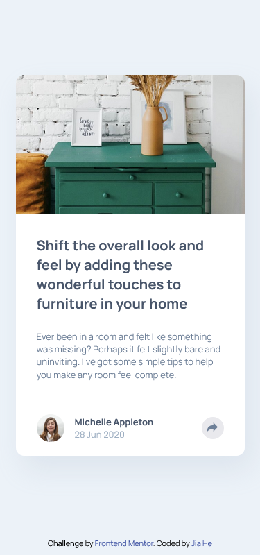
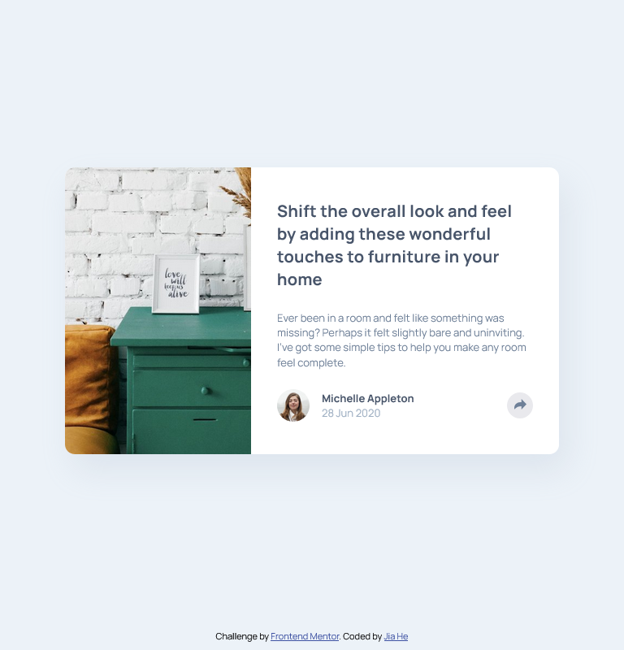
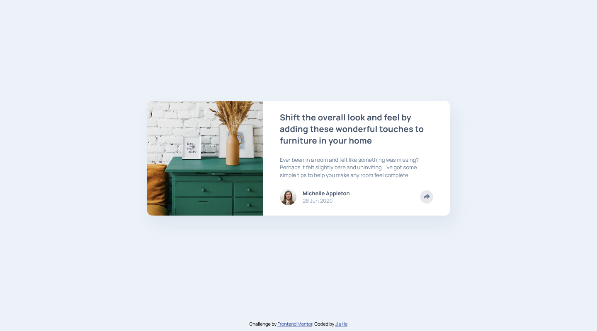

# Frontend Mentor - Article preview component solution

This is my solution to the [Article preview component challenge on Frontend Mentor](https://www.frontendmentor.io/challenges/article-preview-component-dYBN_pYFT). Frontend Mentor challenges help you improve your coding skills by building realistic projects.

## Table of contents

- [Overview](#overview)
  - [The challenge](#the-challenge)
  - [Screenshot](#screenshot)
  - [Links](#links)
- [My process](#my-process)
  - [Built with](#built-with)
  - [What I learned](#what-i-learned)
  - [Continued development](#continued-development)
  - [Useful resources](#useful-resources)
- [Author](#author)

**Note: Delete this note and update the table of contents based on what sections you keep.**

## Overview

### The challenge

Users should be able to:

- View the optimal layout for the component depending on their device's screen size
- See the social media share links when they click the share icon

### Screenshot

#### 📱 Mobile



#### 📲 Tablet



#### 💻 Desktop



### Links

- Solution URL: [My solution](https://www.frontendmentor.io/solutions/article-preview-component-using-html-css-flexbox-and-javascript-HC0cvYHzNY)
- Live Site URL: [Live site URL](https://article-preview-component-jiah.netlify.app/)

## My process

### Built with

- Semantic HTML5 markup
- CSS custom properties
- Flexbox
- Javascript

### What I learned

Through building this Article Preview Component, I’ve deepened my understanding and improved my skills in the following areas:

#### DOM Manipulation with JavaScript

- I practiced selecting and manipulating elements using querySelector().

- I learned how to toggle CSS classes dynamically using .classList.toggle() to change styles and visibility based on user interaction.

- I used .classList.add() and .classList.remove() to explicitly control the state of elements, ensuring more predictable behavior.

#### Responsive Behavior with JavaScript + Media Queries

- I implemented different interactions for desktop and mobile screens using JavaScript and window.innerWidth.

- I learned how to adapt behavior conditionally depending on screen size, such as hiding and showing specific elements (e.g., showing the mobile share icon or hiding the desktop button on smaller screens).

#### Dynamic Styling and State Management

- I used CSS classes (like .icon-white, .btn-darker, .hide, and .show-popup) to visually reflect the app’s state.

- I learned how to manage multiple elements (like changing icon color or hiding a button) together to create a seamless user experience.

There are some code snippets I'm proud of:

```css
@media (max-width: 37.5em) {
  /* Set .text-box to position: relative so the absolutely positioned .popup is correctly placed on mobile screens */
  .text-box {
    position: relative;
  }

  .share-container {
    position: unset;
  }

  .popup {
    bottom: 0;
    left: 0;
    transform: translate(0, 0);
    width: 100%;
    height: 7.6rem;
    padding: 0 3rem;
    border-radius: 0;
    margin-bottom: 0.5rem;
    border-bottom-left-radius: 8px;
    border-bottom-right-radius: 8px;

    display: flex;
    justify-content: space-between;
    align-items: center;
    background: var(--dark-grayish-blue);
  }

  .popup .arrow-down {
    display: none;
  }
}
```

```js
function showDesktopPopup() {
  popup.classList.toggle("show-popup");
  btnShareDesktop.classList.toggle("btn-darker");
  iconShareDesk.classList.toggle("icon-white");
}

function showMobilePopup() {
  popup.classList.toggle("show-popup");
  btnShareDesktop.classList.add("hide");
  btnShareMobile.classList.add("btn-darker");
  iconShareMobile.classList.add("icon-white");
}

btnShareDesktop.addEventListener("click", function () {
  if (window.innerWidth <= 600) {
    showMobilePopup();
  } else {
    showDesktopPopup();
  }
});
```

### Continued development

I would like to continue improving my understanding of JavaScript event handling and DOM manipulation, especially in creating responsive interactions for different screen sizes.
Additionally, I want to get more comfortable using media queries to create smooth, responsive designs and explore how JavaScript can adapt functionality based on screen width more efficiently.

### Useful resources

- [Google fonts -- Manrope](https://fonts.google.com/specimen/Manrope)

## Author

- Frontend Mentor - [@JiaHe35354](https://www.frontendmentor.io/profile/JiaHe35354)
